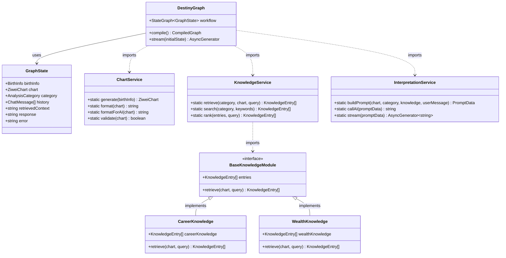
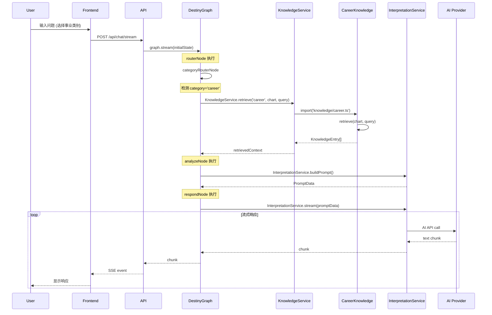
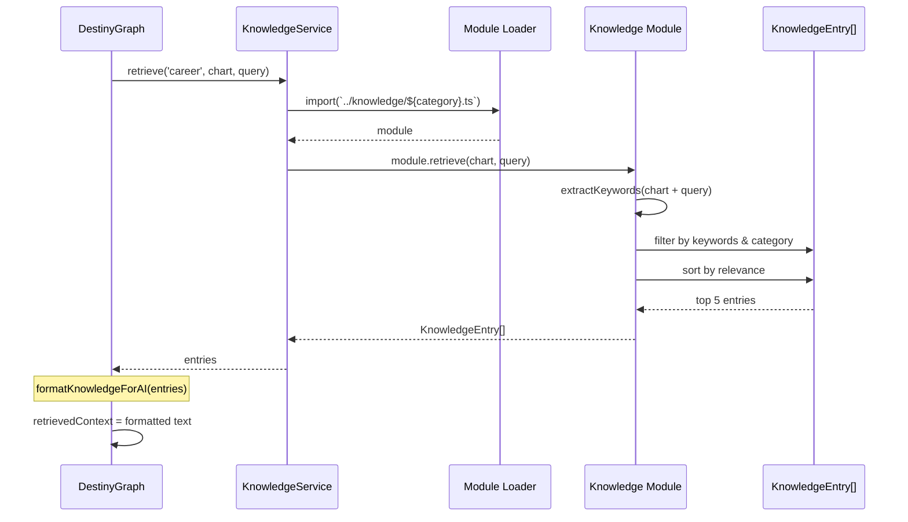

# 紫微斗数系统架构重构设计文档

> 文档版本: 1.0
> 创建日期: 2026-01-02
> 目标: 从线性状态机迁移到 LangGraph 图状态机架构

---

## 目录

1. [架构概述](#架构概述)
2. [现状分析](#现状分析)
3. [目标架构](#目标架构)
4. [类图设计](#类图设计)
5. [序列图](#序列图)
6. [详细设计](#详细设计)
7. [实施计划](#实施计划)
8. [测试策略](#测试策略)

---

## 架构概述

### 重构目标

将当前基于线性状态机的 `DestinyAnalysisAgent` 重构为基于 LangGraph 的图状态机架构，实现：

- **条件路由**: 根据分析类别动态选择知识库
- **服务分离**: Chart、Knowledge、Interpretation 三层解耦
- **模块化知识库**: 按分类拆分为独立文件
- **可扩展性**: 支持向量数据库迁移和并行节点

---

## 现状分析

### 当前架构图

```
┌─────────────────────────────────────────────────────────────┐
│                    前端 (React + Zustand)                   │
└─────────────────────────────────────────────────────────────┘
                            │
                            ▼
┌─────────────────────────────────────────────────────────────┐
│                    Express API Layer                        │
│              POST /api/chat/stream                          │
└─────────────────────────────────────────────────────────────┘
                            │
                            ▼
┌─────────────────────────────────────────────────────────────┐
│              DestinyAnalysisAgent (当前实现)                 │
│  ┌──────────┐    ┌──────────┐    ┌──────────┐             │
│  │  init    │ -> │ retrieve │ -> │ analyze  │             │
│  └──────────┘    └──────────┘    └──────────┘             │
│                                          │                  │
│                                          ▼                  │
│                                    ┌──────────┐            │
│                                    │ respond  │            │
│                                    └──────────┘            │
└─────────────────────────────────────────────────────────────┘
        │                                   │
        ▼                                   ▼
┌───────────────┐                 ┌──────────────────┐
│ knowledge/    │                 │ AI Provider      │
│ index.ts      │                 │ (Anthropic/      │
│ (单一文件)    │                 │  MiniMax)        │
└───────────────┘                 └──────────────────┘
```

### 现状问题

| 问题 | 描述 | 影响 |
|------|------|------|
| **线性状态机** | 只有 `init -> retrieve -> analyze -> respond` 单一路径 | 无法根据 category 动态路由 |
| **职责混乱** | Agent 类包揽生成、检索、分析、响应所有逻辑 | 难以单元测试，违反 SRP |
| **知识库耦合** | 所有知识硬编码在 `knowledge/index.ts` | 新增分类需修改核心文件 |
| **无服务层** | 业务逻辑直接写在 Agent 中 | 代码复用性差 |

### 当前状态机流程

```typescript
// 当前: backend/src/agents/destinyAgent.ts
const stateTransitions = {
  init: ['retrieve'],
  retrieve: ['analyze'],
  analyze: ['respond'],
  respond: ['done'],
  error: ['init'],
  done: []
};
```

---

## 目标架构

### LangGraph 图状态机架构

```
┌─────────────────────────────────────────────────────────────────────┐
│                        前端 (React + Zustand)                      │
└─────────────────────────────────────────────────────────────────────┘
                                  │
                                  ▼
┌─────────────────────────────────────────────────────────────────────┐
│                      Express API Layer                              │
│                POST /api/chat/stream                                │
└─────────────────────────────────────────────────────────────────────┘
                                  │
                                  ▼
┌─────────────────────────────────────────────────────────────────────┐
│                   DestinyGraph (LangGraph)                          │
│                                                                     │
│    ┌──────────────┐     ┌─────────────────────┐                    │
│    │ routerNode   │────▶│ categoryRouterNode  │                    │
│    └──────────────┘     └─────────────────────┘                    │
│                                  │                                  │
│                ┌─────────────────┼─────────────────┐               │
│                ▼                 ▼                 ▼               │
│      ┌─────────────┐   ┌─────────────┐   ┌─────────────┐          │
│      │retrieveCareer│  │retrieveWealth│ │retrieve...   │          │
│      └─────────────┘   └─────────────┘   └─────────────┘          │
│                │                 │                 │               │
│                └─────────────────┼─────────────────┘               │
│                                  ▼                                  │
│                       ┌──────────────┐                             │
│                       │ analyzeNode  │                             │
│                       └──────────────┘                             │
│                                  │                                  │
│                                  ▼                                  │
│                       ┌──────────────┐                             │
│                       │ respondNode  │────▶ END                    │
│                       └──────────────┘                             │
└─────────────────────────────────────────────────────────────────────┘
            │               │               │
            ▼               ▼               ▼
  ┌──────────────┐ ┌──────────────┐ ┌──────────────────────┐
  │ ChartService │ │KnowledgeSvc  │ │ InterpretationService │
  │ (纯函数)     │ │ (检索层)     │ │ (AI调用层)           │
  └──────────────┘ └──────────────┘ └──────────────────────┘
                              │
                              ▼
                ┌─────────────────────────────┐
                │    专有知识库 (模块化)       │
                ├─────────────────────────────┤
                │ knowledge/career.ts         │
                │ knowledge/wealth.ts         │
                │ knowledge/relationship.ts   │
                │ knowledge/health.ts         │
                │ knowledge/family.ts         │
                │ knowledge/general.ts        │
                └─────────────────────────────┘
```

---

## 类图设计

### 核心类图



### 数据流类图

```mermaid
classDiagram
    class ChatRequest {
        +string prompt
        +string chart
        +AnalysisCategory category
        +ChatMessage[] history
    }

    class PromptData {
        +string system
        +MessageParam[] messages
    }

    class KnowledgeEntry {
        +string id
        +AnalysisCategory category
        +string title
        +string content
        +string[] stars
        +string[] palaces
        +string[] keywords
    }

    class ApiResponse~T~ {
        +boolean success
        +T data
        +string error
    }

    ChatRequest --> GraphState : transforms to
    GraphState --> KnowledgeEntry[] : retrieves
    KnowledgeEntry[] --> PromptData : builds
    PromptData --> ApiResponse~string~ : generates
```

---

## 序列图

### 用户请求流程



### 知识检索流程



---

## 详细设计

### 1. 图状态定义

```typescript
// backend/src/types/graph.ts

/**
 * LangGraph 状态接口
 */
export interface GraphState {
  // 输入状态
  birthInfo: BirthInfo;
  category: AnalysisCategory;
  history: ChatMessage[];

  // 中间状态
  chart?: ZiweiChart;
  retrievedContext?: string;
  promptData?: PromptData;

  // 输出状态
  response?: string;

  // 错误状态
  error?: string;
}

/**
 * 图状态通道定义 (用于 LangGraph)
 */
export const stateChannels = {
  birthInfo: null,
  chart: null,
  category: null,
  history: [],
  retrievedContext: null,
  promptData: null,
  response: null,
  error: null,
} as const;
```

### 2. 节点函数设计

```typescript
// backend/src/graph/nodes.ts

import type { GraphState } from '../types/graph.js';
import { ChartService } from '../services/chartService.js';
import { KnowledgeService } from '../services/knowledgeService.js';
import { InterpretationService } from '../services/interpretationService.js';

/**
 * 路由节点 - 根据 category 决定下一步
 * 返回下一个节点名称
 */
export async function routerNode(
  state: GraphState
): Promise<{ nextNode: string }> {
  const { category } = state;

  const categoryToNodeMap: Record<AnalysisCategory, string> = {
    career: 'retrieveCareer',
    wealth: 'retrieveWealth',
    relationship: 'retrieveRelationship',
    health: 'retrieveHealth',
    family: 'retrieveFamily',
    general: 'retrieveGeneral',
  };

  return { nextNode: categoryToNodeMap[category] };
}

/**
 * 事业知识检索节点
 */
export async function retrieveCareerNode(
  state: GraphState
): Promise<Partial<GraphState>> {
  const { chart, history } = state;
  if (!chart) throw new Error('Chart is required');

  const userMessage = getUserMessage(history);

  // 调用知识服务
  const entries = await KnowledgeService.retrieve(
    'career',
    chart,
    userMessage
  );

  const context = formatKnowledgeForAI(entries);

  return { retrievedContext: context };
}

/**
 * 财运知识检索节点
 */
export async function retrieveWealthNode(
  state: GraphState
): Promise<Partial<GraphState>> {
  const { chart, history } = state;
  if (!chart) throw new Error('Chart is required');

  const userMessage = getUserMessage(history);
  const entries = await KnowledgeService.retrieve('wealth', chart, userMessage);
  const context = formatKnowledgeForAI(entries);

  return { retrievedContext: context };
}

// ... 其他 retrieve 节点类似结构

/**
 * 分析节点 - 构建提示词
 */
export async function analyzeNode(
  state: GraphState
): Promise<Partial<GraphState>> {
  const { chart, category, retrievedContext, history } = state;

  if (!chart || !retrievedContext) {
    throw new Error('Missing required state for analysis');
  }

  const userMessage = getUserMessage(history);
  const chartText = ChartService.formatForAI(chart);

  const promptData = InterpretationService.buildPrompt(
    chartText,
    category!,
    retrievedContext,
    userMessage
  );

  return { promptData };
}

/**
 * 响应节点 - 生成 AI 回复 (非流式)
 */
export async function respondNode(
  state: GraphState
): Promise<Partial<GraphState>> {
  const { promptData } = state;

  if (!promptData) {
    throw new Error('Missing prompt data for response');
  }

  const response = await InterpretationService.callAI(promptData);

  return { response };
}

/**
 * 辅助函数 - 获取用户最新消息
 */
function getUserMessage(history: ChatMessage[]): string {
  const lastMessage = history[history.length - 1];
  return lastMessage?.content || '';
}

/**
 * 辅助函数 - 格式化知识库内容
 */
function formatKnowledgeForAI(entries: KnowledgeEntry[]): string {
  if (entries.length === 0) return '未找到相关知识';

  return entries
    .map(entry => `【${entry.title}】\n${entry.content}`)
    .join('\n\n---\n\n');
}
```

### 3. 图构建器设计

```typescript
// backend/src/graph/destinyGraph.ts

import { StateGraph, END } from '@langchain/langgraph';
import type { GraphState } from '../types/graph.js';
import { stateChannels } from '../types/graph.js';
import * as nodes from './nodes.js';

/**
 * 创建紫微斗数分析图
 */
export function createDestinyGraph() {
  // 1. 创建状态图
  const workflow = new StateGraph<GraphState>({
    channels: stateChannels,
  });

  // 2. 添加所有节点
  workflow.addNode('router', nodes.routerNode);
  workflow.addNode('retrieveCareer', nodes.retrieveCareerNode);
  workflow.addNode('retrieveWealth', nodes.retrieveWealthNode);
  workflow.addNode('retrieveRelationship', nodes.retrieveRelationshipNode);
  workflow.addNode('retrieveHealth', nodes.retrieveHealthNode);
  workflow.addNode('retrieveFamily', nodes.retrieveFamilyNode);
  workflow.addNode('retrieveGeneral', nodes.retrieveGeneralNode);
  workflow.addNode('analyze', nodes.analyzeNode);
  workflow.addNode('respond', nodes.respondNode);

  // 3. 添加条件边 (路由器 -> 知识检索节点)
  workflow.addConditionalEdges(
    'router',
    (state: GraphState) => state.nextNode,
    {
      retrieveCareer: 'retrieveCareer',
      retrieveWealth: 'retrieveWealth',
      retrieveRelationship: 'retrieveRelationship',
      retrieveHealth: 'retrieveHealth',
      retrieveFamily: 'retrieveFamily',
      retrieveGeneral: 'retrieveGeneral',
    }
  );

  // 4. 添加固定边 (所有检索节点 -> 分析 -> 响应 -> 结束)
  const retrieveNodes = [
    'retrieveCareer',
    'retrieveWealth',
    'retrieveRelationship',
    'retrieveHealth',
    'retrieveFamily',
    'retrieveGeneral',
  ];

  for (const node of retrieveNodes) {
    workflow.addEdge(node, 'analyze');
  }

  workflow.addEdge('analyze', 'respond');
  workflow.addEdge('respond', END);

  // 5. 设置入口点
  workflow.setEntryPoint('router');

  // 6. 编译图
  return workflow.compile();
}

// 导出单例
export const destinyGraph = createDestinyGraph();
```

### 4. 服务层设计

#### ChartService

```typescript
// backend/src/services/chartService.ts

import type { BirthInfo, ZiweiChart } from '../types/index.js';
import { getChartBySolarDate } from 'iztro';

export class ChartService {
  /**
   * 生成命盘
   */
  static generate(birthInfo: BirthInfo): ZiweiChart {
    const { year, month, day, hour, gender } = birthInfo;

    const chart = getChartBySolarDate(
      `${year}-${month}-${day}`,
      hour,
      gender === 'male'
    );

    return chart as ZiweiChart;
  }

  /**
   * 格式化为可读文本 (完整版，用于 AI 和报告)
   */
  static format(chart: ZiweiChart): string {
    // ... 实现格式化逻辑
    return formatChartToReadableText(chart);
  }

  /**
   * 格式化为 AI 简洁版
   */
  static formatForAI(chart: ZiweiChart): string {
    // ... 实现简洁版格式化
    return formatChartForAI(chart);
  }

  /**
   * 验证命盘完整性
   */
  static validate(chart: ZiweiChart): boolean {
    return (
      !!chart.birthInfo &&
      !!chart.palaces &&
      chart.palaces.length === 12
    );
  }
}
```

#### KnowledgeService

```typescript
// backend/src/services/knowledgeService.ts

import type { AnalysisCategory, KnowledgeEntry, ZiweiChart } from '../types/index.js';

export class KnowledgeService {
  /**
   * 根据类别检索知识
   * 使用动态导入加载对应的专有知识库模块
   */
  static async retrieve(
    category: AnalysisCategory,
    chart: string,
    query: string
  ): Promise<KnowledgeEntry[]> {
    try {
      // 动态导入对应的知识库模块
      const module = await import(`../knowledge/${category}.js`);

      // 调用模块的 retrieve 函数
      const entries = module.retrieve(chart, query);

      return entries;
    } catch (error) {
      console.error(`Failed to load knowledge module for ${category}:`, error);

      // 回退到通用知识库
      const generalModule = await import('../knowledge/general.js');
      return generalModule.retrieve(chart, query);
    }
  }

  /**
   * 关键词搜索
   */
  static async search(
    category: AnalysisCategory,
    keywords: string[]
  ): Promise<KnowledgeEntry[]> {
    const module = await import(`../knowledge/${category}.js`);
    return module.searchByKeywords(keywords);
  }

  /**
   * 相关性排序
   */
  static rank(entries: KnowledgeEntry[], query: string): KnowledgeEntry[] {
    const queryLower = query.toLowerCase();

    return entries
      .map(entry => ({
        ...entry,
        score: this.calculateRelevance(entry, queryLower),
      }))
      .sort((a, b) => b.score - a.score)
      .slice(0, 5);
  }

  /**
   * 计算相关性分数
   */
  private static calculateRelevance(
    entry: KnowledgeEntry,
    query: string
  ): number {
    let score = 0;

    // 标题匹配权重最高
    if (entry.title.toLowerCase().includes(query)) {
      score += 10;
    }

    // 关键词匹配
    entry.keywords.forEach(keyword => {
      if (query.includes(keyword.toLowerCase())) {
        score += 5;
      }
    });

    // 星曜匹配
    entry.stars?.forEach(star => {
      if (query.includes(star)) {
        score += 3;
      }
    });

    // 宫位匹配
    entry.palaces?.forEach(palace => {
      if (query.includes(palace)) {
        score += 2;
      }
    });

    return score;
  }
}
```

#### InterpretationService

```typescript
// backend/src/services/interpretationService.ts

import Anthropic from '@anthropic-ai/sdk';
import type { PromptData, ChatMessage, AnalysisCategory } from '../types/index.js';
import { createMiniMaxClient } from '../clients/minimaxClient.js';

export class InterpretationService {
  private static anthropic: Anthropic | null = null;
  private static minimaxClient = createMiniMaxClient();
  private static provider: AIProvider = 'minimax';

  /**
   * 构建分析提示词
   */
  static buildPrompt(
    chart: string,
    category: AnalysisCategory,
    knowledge: string,
    userMessage: string,
    history: ChatMessage[] = []
  ): PromptData {
    const categoryNames: Record<AnalysisCategory, string> = {
      career: '事业运势',
      wealth: '财运分析',
      relationship: '感情姻缘',
      health: '健康运势',
      family: '家庭亲缘',
      general: '综合分析',
    };

    const systemPrompt = `你是一位精通紫微斗数的命理分析师，名叫"天机大师"。

当前分析主题：${categoryNames[category]}

用户的命盘信息：
${chart}

相关知识库参考：
${knowledge}

请根据以上信息回答用户的问题，结合命盘中的具体星曜位置进行分析，给出具体、可操作的建议。`;

    const messages: Anthropic.MessageParam[] = [
      ...history.map(m => ({
        role: m.role as 'user' | 'assistant',
        content: m.content,
      })),
      { role: 'user', content: userMessage },
    ];

    return { system: systemPrompt, messages };
  }

  /**
   * 调用 AI (非流式)
   */
  static async callAI(promptData: PromptData): Promise<string> {
    if (this.provider === 'minimax' && this.minimaxClient) {
      const messages: MiniMaxMessage[] = [
        { role: 'system', content: promptData.system },
        ...promptData.messages,
      ];
      return await this.minimaxClient.chat(messages);
    }

    if (this.provider === 'anthropic' && this.anthropic) {
      const response = await this.anthropic.messages.create({
        model: 'claude-sonnet-4-20250514',
        max_tokens: 2048,
        system: promptData.system,
        messages: promptData.messages,
      });

      const content = response.content[0];
      return content.type === 'text' ? content.text : '无法生成回复';
    }

    return this.getMockResponse();
  }

  /**
   * 流式调用 AI
   */
  static async *stream(promptData: PromptData): AsyncGenerator<string> {
    if (this.provider === 'minimax' && this.minimaxClient) {
      const messages: MiniMaxMessage[] = [
        { role: 'system', content: promptData.system },
        ...promptData.messages,
      ];

      for await (const chunk of this.minimaxClient.streamChat(messages)) {
        yield chunk;
      }
      return;
    }

    if (this.provider === 'anthropic' && this.anthropic) {
      const stream = await this.anthropic.messages.stream({
        model: 'claude-sonnet-4-20250514',
        max_tokens: 2048,
        system: promptData.system,
        messages: promptData.messages,
      });

      for await (const event of stream) {
        if (event.type === 'content_block_delta') {
          const delta = event.delta;
          if ('text' in delta) {
            yield delta.text;
          }
        }
      }
      return;
    }

    // Mock 响应
    const mock = this.getMockResponse();
    for (const char of mock) {
      yield char;
      await new Promise(resolve => setTimeout(resolve, 20));
    }
  }

  private static getMockResponse(): string {
    return '这是模拟的 AI 回复...';
  }
}
```

### 5. 知识库模块设计

```typescript
// backend/src/knowledge/career.ts

import type { KnowledgeEntry } from '../types/index.js';

/**
 * 事业知识库数据
 */
export const careerKnowledge: KnowledgeEntry[] = [
  {
    id: 'career-1',
    category: 'career',
    title: '官禄宫主星分析',
    content: `官禄宫是紫微斗数中主管事业发展、工作运势的关键宫位。

【紫微星在官禄宫】
- 主贵显，适合公职、管理岗位
- 具有领导才能，能够统御下属
...`,
    stars: ['紫微', '武曲', '天机'],
    palaces: ['官禄宫'],
    keywords: ['事业', '工作', '职业', '发展'],
  },
  // ... 更多条目
];

/**
 * 事业专有检索逻辑
 */
export function retrieve(chart: string, query: string): KnowledgeEntry[] {
  const keywords = extractKeywords(chart + ' ' + query);

  return careerKnowledge
    .filter(entry => matchKeywords(entry, keywords))
    .slice(0, 5);
}

/**
 * 关键词提取 (事业专用)
 */
function extractKeywords(text: string): string[] {
  const patterns = [
    '紫微', '天机', '太阳', '武曲',
    '官禄宫', '事业', '工作', '职业',
    '化禄', '化权', '化科', '化忌',
    // ... 事业相关关键词
  ];

  return patterns.filter(p => text.includes(p));
}

/**
 * 关键词匹配
 */
function matchKeywords(entry: KnowledgeEntry, keywords: string[]): boolean {
  return keywords.some(kw =>
    entry.keywords.includes(kw) ||
    entry.stars?.includes(kw) ||
    entry.palaces?.includes(kw)
  );
}

/**
 * 按关键词搜索
 */
export function searchByKeywords(keywords: string[]): KnowledgeEntry[] {
  return careerKnowledge.filter(entry =>
    keywords.some(kw =>
      entry.title.includes(kw) ||
      entry.keywords.some(k => k.includes(kw))
    )
  );
}
```

---

## 实施计划

### Phase 1: 服务层抽取 (1-2天)

**目标**: 不改变现有流程，先解耦代码

```
backend/src/services/
├── chartService.ts          # 命盘生成与格式化
├── knowledgeService.ts      # 知识检索服务
└── interpretationService.ts # AI 调用服务
```

**检查点**:
- [ ] ChartService 有 `generate()`, `format()`, `validate()` 方法
- [ ] KnowledgeService 有 `retrieve()` 方法
- [ ] InterpretationService 有 `buildPrompt()`, `callAI()`, `stream()` 方法
- [ ] DestinyAnalysisAgent 内部调用新服务层
- [ ] 现有 API 端点功能不变
- [ ] 所有测试通过

### Phase 2: 知识库模块化 (1天)

**目标**: 按分类拆分知识库

```
backend/src/knowledge/
├── index.ts          # 统一导出接口
├── career.ts         # 事业知识库 + retrieve()
├── wealth.ts         # 财运知识库 + retrieve()
├── relationship.ts   # 感情知识库 + retrieve()
├── health.ts         # 健康知识库 + retrieve()
├── family.ts         # 家庭知识库 + retrieve()
└── general.ts        # 综合知识库 + retrieve()
```

**检查点**:
- [ ] 每个分类文件有独立的 `KnowledgeEntry[]` 和 `retrieve()` 函数
- [ ] `knowledge/index.ts` 统一导出所有模块
- [ ] KnowledgeService 使用动态导入加载对应模块
- [ ] 检索结果与重构前一致

### Phase 3: 引入 LangGraph (0.5天)

**目标**: 安装依赖并创建基础图

```bash
cd backend
npm install @langchain/langgraph @langchain/core
```

```
backend/src/graph/
├── destinyGraph.ts    # 图构建器
└── nodes.ts           # 节点函数
```

**检查点**:
- [ ] LangGraph 依赖安装成功
- [ ] 创建基础 StateGraph
- [ ] 添加简单节点并编译
- [ ] 图可以执行但不替换现有 Agent

### Phase 4: 实现条件路由 (1天)

**目标**: 根据 category 动态路由

**检查点**:
- [ ] 添加 6 个专有知识检索节点
- [ ] 实现 `routerNode` 条件路由函数
- [ ] 配置条件边
- [ ] 不同 category 请求走不同节点

### Phase 5: 迁移 API 端点 (1天)

**目标**: `/api/chat/stream` 使用新图

**检查点**:
- [ ] 更新 chat route 使用 `destinyGraph.stream()`
- [ ] SSE 流式响应正常
- [ ] 错误处理完整
- [ ] 前端无感知切换

### Phase 6: 清理旧代码 (0.5天)

**检查点**:
- [ ] 删除 DestinyAnalysisAgent 类
- [ ] 清理 knowledge/index.ts 冗余代码
- [ ] 更新 CLAUDE.md 文档
- [ ] 添加架构图注释

---

## 测试策略

### 单元测试

```typescript
// backend/src/services/__tests__/chartService.test.ts

describe('ChartService', () => {
  it('should generate chart from birth info', () => {
    const birthInfo: BirthInfo = {
      year: 1993,
      month: 3,
      day: 30,
      hour: 18,
      gender: 'female',
      isLunar: false,
    };

    const chart = ChartService.generate(birthInfo);

    expect(chart).toBeDefined();
    expect(chart.birthInfo).toEqual(birthInfo);
  });

  it('should validate correct chart', () => {
    const chart = mockValidChart();
    expect(ChartService.validate(chart)).toBe(true);
  });
});
```

### 集成测试

```typescript
// backend/src/graph/__tests__/destinyGraph.test.ts

describe('DestinyGraph', () => {
  it('should route career category to career knowledge', async () => {
    const initialState: GraphState = {
      birthInfo: mockBirthInfo(),
      category: 'career',
      history: [{ role: 'user', content: '我的事业发展如何？' }],
    };

    const result = await destinyGraph.invoke(initialState);

    expect(result.retrievedContext).toContain('官禄宫');
  });

  it('should route wealth category to wealth knowledge', async () => {
    const initialState: GraphState = {
      birthInfo: mockBirthInfo(),
      category: 'wealth',
      history: [{ role: 'user', content: '我的财运如何？' }],
    };

    const result = await destinyGraph.invoke(initialState);

    expect(result.retrievedContext).toContain('财帛宫');
  });
});
```

### 端到端测试

```typescript
// backend/src/routes/__tests__/chat.test.ts

describe('POST /api/chat/stream', () => {
  it('should return streaming response', async () => {
    const response = await request(app)
      .post('/api/chat/stream')
      .send({
        chart: mockChartData,
        category: 'career',
        history: [{ role: 'user', content: '我的事业如何？' }],
      })
      .expect('Content-Type', /text\/event-stream/);

    const chunks = await collectSSEChunks(response);
    expect(chunks.length).toBeGreaterThan(0);
  });
});
```

---

## 附录

### 文件结构对比

**重构前**:
```
backend/src/
├── agents/
│   └── destinyAgent.ts        # 所有逻辑集中
├── knowledge/
│   └── index.ts               # 单一知识库文件
└── types/
    └── index.ts
```

**重构后**:
```
backend/src/
├── graph/
│   ├── destinyGraph.ts        # LangGraph 构建
│   └── nodes.ts               # 节点函数
├── services/
│   ├── chartService.ts        # 命盘服务
│   ├── knowledgeService.ts    # 知识服务
│   └── interpretationService.ts # AI 服务
├── knowledge/
│   ├── index.ts               # 统一导出
│   ├── career.ts              # 事业模块
│   ├── wealth.ts              # 财运模块
│   ├── relationship.ts        # 感情模块
│   ├── health.ts              # 健康模块
│   ├── family.ts              # 家庭模块
│   └── general.ts             # 综合模块
├── types/
│   ├── index.ts
│   └── graph.ts               # 图状态类型
└── routes/
    └── chat.ts                # 使用新图
```

---

*文档结束*
